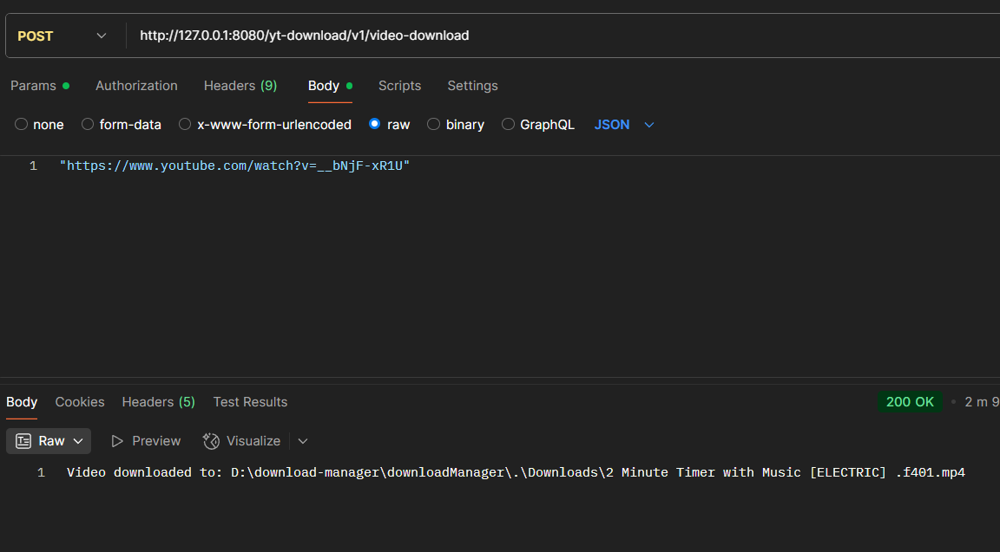
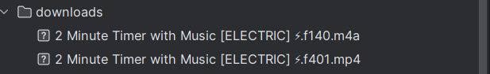

# YouTube Video Downloader
A Spring Boot REST application to download YouTube videos as single MP4 files with audio and video using yt-dlp

## Features
Download YouTube videos via a REST API endpoint (/api/download).
Saves videos files without merged audio and video to the ./downloads/ directory.
Built with Spring Boot, Lombok, and yt-dlp for robust video downloading.

## Prerequisites
- Java 21: Install JDK 21 (e.g., OpenJDK or Oracle JDK).
- Maven: For building and running the Spring Boot application.
- yt-dlp: Command-line tool for downloading YouTube videos.
- FFmpeg: For merging audio and video streams into a single MP4 file.

## 📸 Screenshots

### API calls and downloads

  

  

## Contributing
Contributions are welcome to enhance this project! Please submit pull requests or open issues on the repository.
### Future Improvements:

- Modern UI: Build a user-friendly interface using React.js with Tailwind CSS.
- Concurrent Downloads: Implement multi-threaded downloading for faster performance on large videos.
- Enhanced Error Handling: Add detailed error messages and recovery mechanisms.
- Download Progress Tracking: Show real-time download progress in the API or UI.
- Playlist Support: Allow downloading entire YouTube playlists.

#### Follow this tutorial to setup yt-dlp
https://github.com/yt-dlp/yt-dlp